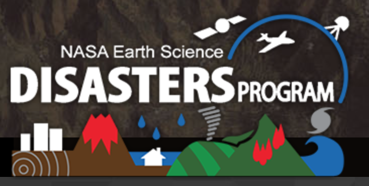

# Abacus Team for NASA

NASA International Space Apps Challenge - From curious minds come helping hands

<table border="0">
 <tr>
  
    <td>
    </td>
  
    <td>
     

      <b> Our team </b>
      https://2019.spaceappschallenge.org/challenges/living-our-world/curious-minds-come-helping-hands/teams/abacus/stream
      

      <b> Who are we? </b>
      
- Dani Ushizima, PhD - data scientist Berkeley, USA
      
- Prof. Marilia Pisani, PhD - social scientist Sao Paulo, Brazil      
      </td>
 </tr>
</table>

